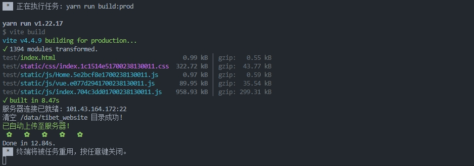
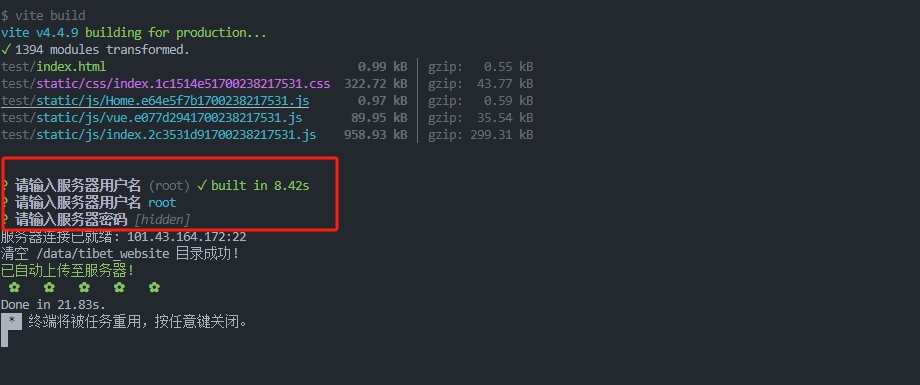

# vite-plugin-deployer

Vite 自动化发布插件，解决频繁手动操作服务器的过程，彻底解放你的双手!!!

从此让你不必再害怕 rm -rf \* ，你懂得...


 

## 安装

```sh
# npm
npm install -D vite-plugin-auto-deployer 

# yarn
yarn add -D vite-plugin-auto-deployer

# pnpm
pnpm add -D vite-plugin-auto-deployer
```

## 使用教程
插件会自动读取outDir目录，更加灵活
```js
// vite.config.js
import AutoDeployer from "vite-plugin-auto-deployer";

// 定义服务器相关信息
const serverInfo = {
  name: "测试环境",
  host: "101.43.164.172", // 主机地址
  port: 22, // 端口
  // 用户名密码按个人所需是否记住,非必须，
  // 不填会提问，常用于生产环境，避免服务器信息泄露
  // username: "root",
  // password: "xxxx",
  path: "/data/website" // 需要上传至的服务器目录
};

export default {
  // ...
  plugins: [AutoDeployer(serverInfo)]
};
```

## 使用截图

##### 用户名密码为空，输入完会自动执行
 

完结，撒花~~~~~~~~~~~~~~~